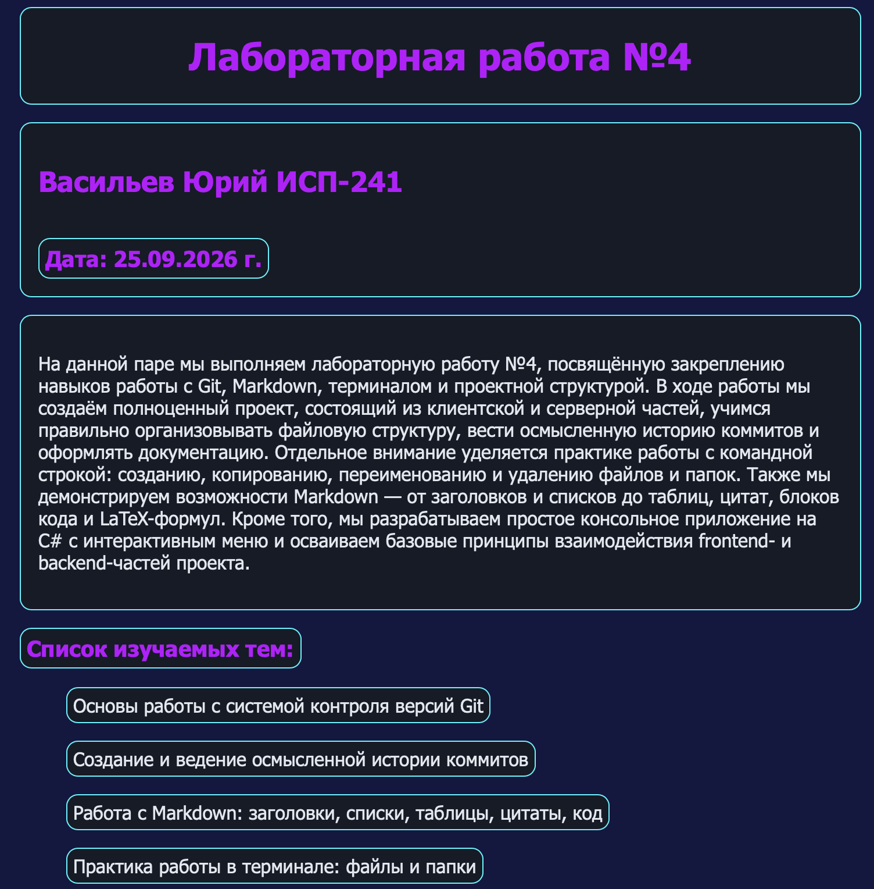

# Лабораторная работа №4. Закрепление навыков работы с Git, Markdown, терминалом и проектной структурой

**ФИО:** Васильев Юрий
**Группа:** ИСП-241
**Дата:** 25.09.2026
***

## Описание проекта
Данный проект представляет собой лабораторную работу №4, в рамках которой были закреплены практические навыки работы с системой контроля версий **Git**, языком разметки **Markdown**, командной строкой (терминалом) и организацией структуры проекта.

В ходе работы были созданы:
- **Frontend-часть** (client) — HTML-страницы с информацией о студенте;
- **Backend-часть** (server) — консольное приложение на C# (.NET);
- **Практика терминала** (terminal_practice) — демонстрация работы с файлами и папками через командную строку;
- **Документация** (docs) — примеры использования Markdown;
- **Скриншоты** (repo) — подтверждение выполнения этапов работы.

Все действия фиксировались с помощью **16+ коммитов** и отправлялись в удалённый GitHub-репозиторий.
***

## Содержание
1. [Описание проекта](#-описание-проекта)
2. [Структура проекта](#-структура-проекта)
3. [Примеры Markdown](#-примеры-markdown)
4. [Пример LaTeX](#-пример-latex)
5. [Ссылка на репозиторий](#-ссылка-на-репозиторий)
6. [Скриншоты](#-скриншоты)
7. [Заключение](#-заключение)
***
## Структура проекта
```
Lab4_ISRPO_Vasilev/
├── client/
|   ├── about.html  
|   └── index.html 
├── docs/
|   ├── latex_examples.md 
|   └── markdown.md
├── repo/
|   ├── backend.png
|   ├── browser.png 
|   ├── terminal.png 
|   └── git_Vasilev.png
├── server/
|   ├── bin/Debug/net10.0/
|   |   ├── server
|   |   ├── server.deps.json 
|   |   ├── server.dll
|   |   ├── server.pdb 
|   |   └── server.runtimeconfig.json
|   ├── obj/
|   |   ├── Debug/net10.0/   
|   |   |   ├── ref/
|   |   |   |   └── server.dll
|   |   |   ├── refint/
|   |   |   |   └── server.dll
|   |   |   ├── .NETCoreApp,Version=v10.0.AssemblyAttributes.cs
|   |   |   ├── apphost
|   |   |   ├── server.AssemblyInfo.cs
|   |   |   ├── server.AssemblyInfoInputs.cache 
|   |   |   ├── server.assets.cache
|   |   |   ├── server.csproj.CoreCompileInputs.cache
|   |   |   ├── server.csproj.FileListAbsolute.txt
|   |   |   ├── server.dll
|   |   |   ├── server.GeneratedMSBuildEditorConfig.editorconfig
|   |   |   ├── server.genruntimeconfig.cache  
|   |   |   ├── server.GlobalUsings.g.cs
|   |   |   └── server.pdb
|   |   ├── project.assets.json
|   |   ├── project.nuget.cache 
|   |   ├── server.csproj.nuget.dgspec.json
|   |   ├── server.csproj.nuget.g.props
|   |   └── server.csproj.nuget.g.targets
|   ├── Program.cs
|   └── server.csproj
├── terminal_pracrice/
|   ├── data/
|   |   └── text.txt   
|   └── logs/
|   |   └── app.logs
README.md   
```
***
## Примеры Markdown
# Заголовок H1
## Заголовок H2
### Заголовок H3
**Список**
* Первый пункт
* Второй пункт
* Третий пункт
***
**Картинка**

***
**Код**
```csharp
Console.WriteLine("Лабораторная работа №4");
Console.WriteLine("ФИО: Васильев Юрий");
Console.WriteLine("Группа: ИСП-241");
```
***
**Примеры LaTeX**
Inline LaTeX: Формула квадрата гипотенузы: $a^2 + b^2 = c^2$
***
**Ссылка на репозиторий**
[Ссылка на репозиторий лабораторной работы №4](https://github.com/YuriiSuperProg/Lab4_ISRPO_Vasilev)
***
**Заключение**
В ходе выполнения лабораторной работы №4 были успешно закреплены навыки:

* создания и ведения GitHub-репозитория;
работы с Git (частые коммиты, push, история изменений);

* использования Markdown для оформления документации;

* работы с терминалом (создание, копирование, переименование и удаление файлов);

* организации структуры проекта (frontend, backend, docs, repo);

* разработки простого консольного приложения на C# (.NET);
* создания HTML-страниц с информацией о студенте.
Все требования выполнены в полном объёме: создано 16+ коммитов, оформлен README.md, добавлены скриншоты, продемонстрированы примеры Markdown и LaTeX.
***
### ФИО: Васильев Юрий
### Группа: ИСП-241
### Дата: 25.09.2026